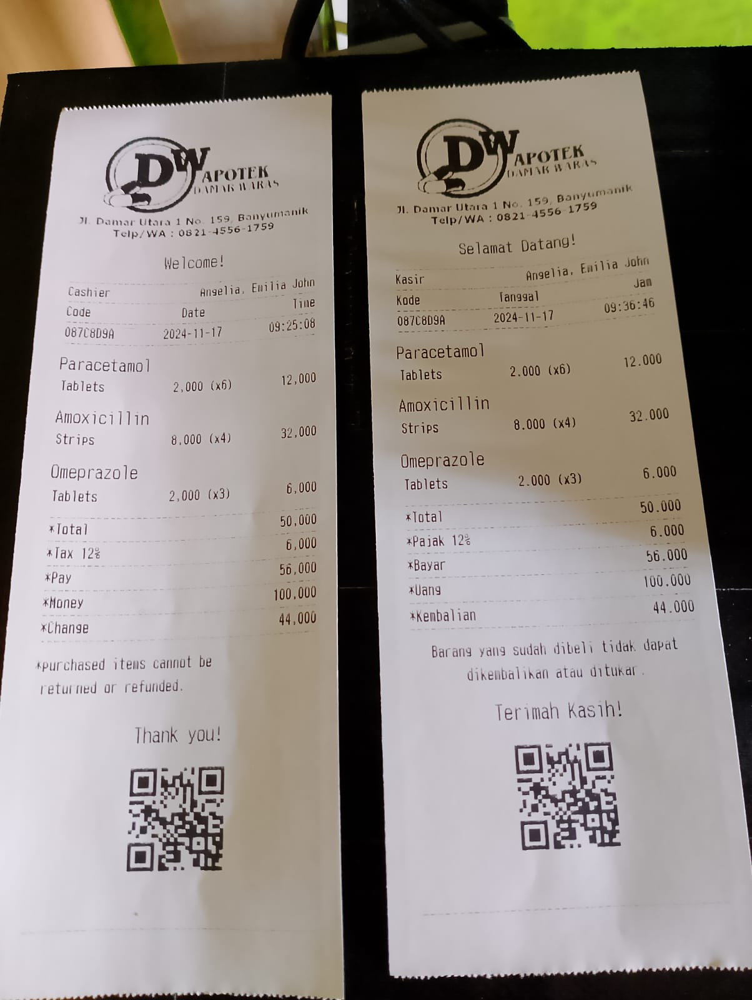

# NokoHwd (Win64)
### Windows CLI Application

- Barcode, QR Code Scanner. (Serial)
- Receipt, Test Printer. (58mm)



### JSON template (Printer Commands)
```json
{
  "code": "087C8D9A",
  "cashier": "Angelia, Emilia John",
  "total": 50000,
  "taxRate": 12,
  "tax": 6000,
  "pay": 56000,
  "money": 100000,
  "change": 44000,
  "qrCode": "https://www.alodev.id/",
  "carts": [
    {
      "name": "Paracetamol",
      "type": "Tablets",
      "qty": 6,
      "price": 2000,
      "total": 12000
    },
    {
      "name": "Amoxicillin",
      "type": "Strips",
      "qty": 4,
      "price": 8000,
      "total": 32000
    },
    {
      "name": "Omeprazole",
      "type": "Tablets",
      "qty": 3,
      "price": 2000,
      "total": 6000
    }
  ]
}
```

### Printer Register Demo

```txt
UNC PATH \\%COMPUTERNAME%\PANDA ESCPOS
Driver Generic / Text Only (Windows 64)
Printer PANDA ESCPOS, USB USB001, VID 0483, PID 070B, REV 0200, Local, Shared
```

### Scanner Outputs (QR Code)

```txt
Data: https://www.alodev.id/
Data: https://www.alodev.id/
Data: https://www.alodev.id/
```

### Scanner Register Demo

```txt
Scanner PANDA, USB Serial COM4, VID, 26F1, PID, 5650, REV 0310, Local, Shared
```
